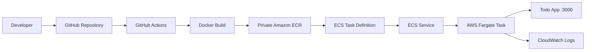

# Docker Todo App → ECR → ECS Fargate

## Overview

This project containerizes a Node.js Todo application with Docker, publishes the image to a private Amazon ECR repository using GitHub Actions, and deploys that image to Amazon ECS Fargate.

## Architecture

### Architecture Diagram



### Deployment Flow

```text
Application Code
      |
      v
   GitHub
      |
      v
GitHub Actions
      |
      +--> Configure AWS credentials
      |
      +--> Login to ECR
      |
      +--> Build Docker image
      |
      +--> Tag image
      |
      +--> Push image
      |
      v
Private Amazon ECR
      |
      v
ECS Task Definition
      |
      v
ECS Service
      |
      v
AWS Fargate Task
      |
      v
Todo App :3000
      |
      v
CloudWatch Logs
```

**Important:** GitHub Actions is used to **build and push the Docker image to ECR**. ECS Fargate then pulls the image from ECR and runs the container. The current deployment does not use an Application Load Balancer.

## Technologies

- AWS
- Docker
- Amazon ECR
- Amazon ECS
- AWS Fargate
- GitHub Actions
- Node.js
- Git/GitHub
- Linux
- CloudWatch Logs

## Docker Implementation

The application is containerized with the following Dockerfile configuration:

- Base image: `node:24-alpine`
- Working directory: `/app`
- Production dependencies installed with `npm install --omit=dev`
- Container port: `3000`
- Startup command: `node src/index.js`

### Run Locally

Build the image:

```bash
docker build -t todo-app .
```

Run the container:

```bash
docker run -d -p 3000:3000 --name mytodo todo-app
```

Verify:

```bash
docker ps
```

Open:

```text
http://localhost:3000
```

## GitHub Actions

Workflow: `.github/workflows/docker-image.yml`

The workflow runs on pushes and pull requests targeting `main`.

It performs these steps:

1. Checkout the repository
2. Configure AWS credentials
3. Authenticate to Amazon ECR
4. Build the Docker image
5. Tag the image for ECR
6. Push the image to the private ECR repository

AWS authentication uses encrypted GitHub repository secrets. The workflow does **not** deploy to ECS.

## Amazon ECR

Private repository:

```text
todo-app
```

The workflow publishes the image using the `latest` tag.

## ECS Fargate Deployment

The ECR image was deployed manually through the AWS console using:

- ECS cluster: `todo-app-cluster`
- Task definition family: `todo-app`
- Task definition revision: `1`
- ECS service: `todo-app-service`
- Desired tasks: `1`
- Task CPU: `0.25 vCPU`
- Task memory: `0.5 GB`
- Container port: `3000/TCP`
- Architecture: Linux/X86_64
- Task execution role: `ecsTaskExecutionRole`
- CloudWatch log group: `/ecs/todo-app`

The Fargate task reached the `RUNNING` state and the Todo application was successfully accessed through the task public IP on port 3000.

## Logging and Verification

CloudWatch container logs were used to verify application startup, including:

```text
Listening on port 3000
Using sqlite database at /etc/todos/todo.db
```

The deployed application was functionally tested by adding a Todo item through the browser.

## Security

- Amazon ECR repository is private
- AWS credentials are stored as encrypted GitHub repository secrets
- ECS uses a task execution role for pulling the private ECR image and sending logs
- Application ingress on TCP port 3000 was restricted to the developer's IP
- AWS credentials are not stored in the Docker image or source code

## What I Learned

- Docker image and container lifecycle
- Dockerfile configuration
- Container port mapping and networking
- Amazon ECR image management
- GitHub Actions workflows
- ECS task definitions and services
- AWS Fargate deployment
- IAM task execution roles
- CloudWatch container logging
- Container troubleshooting
